# Modelo de datos (ERD)

> Última actualización: Fase 0.
> Detalle completo se generará en Fase 1 junto con la primera migración Drizzle.

```mermaid
erDiagram
    PLATFORM ||--o{ DISTRIBUTOR : "tiene"
    PLATFORM ||--o{ USER : "posee"
    PLATFORM ||--o{ AUDIT_LOG : "registra"
    PLATFORM ||--o{ SUPPORT_SESSION : "permite"

    DISTRIBUTOR ||--o{ CLIENT : "tiene"
    DISTRIBUTOR ||--o{ DISTRIBUTOR_MEMBER : "empleados"
    DISTRIBUTOR ||--o{ DISTRIBUTOR_BRANDING : "personaliza"
    DISTRIBUTOR ||--o{ DISTRIBUTOR_MEMBERSHIP : "tiene"
    DISTRIBUTOR ||--o{ COMMISSION_RULE : "aplica"
    DISTRIBUTOR ||--o{ COMMISSION_ENTRY : "genera"
    DISTRIBUTOR ||--o{ PAYOUT : "recibe"

    CLIENT ||--o{ CLIENT_MEMBER : "usuarios"
    CLIENT ||--o{ AGENT : "contrata"
    CLIENT ||--o{ CONVERSATION : "atiende"
    CLIENT ||--o{ CONTACT : "registra"
    CLIENT ||--o{ KNOWLEDGE_BASE : "posee"
    CLIENT ||--o{ CHANNEL_CONNECTION : "conecta"
    CLIENT ||--o{ SUBSCRIPTION : "tiene"
    CLIENT ||--o{ PAYMENT : "realiza"
    CLIENT ||--o{ USAGE_EVENT : "consume"
    CLIENT ||--o{ MESSAGE_CREDIT_LEDGER : "movimientos"

    AGENT ||--o{ AGENT_VERSION : "versionado"
    AGENT ||--o{ AGENT_TOOL : "configura"
    AGENT ||--o{ AGENT_CHANNEL : "canales"
    AGENT ||--o{ AGENT_TEST_SESSION : "pruebas"
    AGENT ||--o{ AGENT_RUN : "ejecuta"

    AGENT_VERSION ||--o{ AGENT_RUN : "publicada"

    AGENT_RUN ||--o{ AGENT_RUN_STEP : "pasos"
    AGENT_RUN ||--o{ TOOL_EXECUTION : "tools"

    KNOWLEDGE_BASE ||--o{ KNOWLEDGE_DOCUMENT : "documentos"
    KNOWLEDGE_DOCUMENT ||--o{ KNOWLEDGE_CHUNK : "fragmentos"
    KNOWLEDGE_DOCUMENT ||--o{ KNOWLEDGE_JOB : "indexación"

    CHANNEL_CONNECTION ||--o{ CONVERSATION : "origen"
    CONVERSATION ||--o{ MESSAGE : "contiene"
    CONVERSATION ||--o{ CONVERSATION_ASSIGNMENT : "asignaciones"
    CONVERSATION ||--o{ INTERNAL_NOTE : "notas"
    CONVERSATION ||--o{ CONVERSATION_SUMMARY : "resúmenes"

    MESSAGE ||--o{ MESSAGE_DELIVERY : "entregas"
    MESSAGE ||--o{ ATTACHMENT : "adjuntos"

    SUBSCRIPTION ||--o{ PLAN_VERSION : "aplica"
    PLAN ||--o{ PLAN_VERSION : "versionado"

    PAYMENT ||--o{ COMMISSION_ENTRY : "origen"
    PAYMENT ||--o{ INVOICE : "factura"
    PAYMENT ||--o{ REFUND : "reembolso"
    PAYMENT ||--o{ CHARGEBACK : "contracargo"

    PAYOUT ||--o{ PAYOUT_ITEM : "incluye"
    COMMISSION_ENTRY }o--|| PAYOUT_ITEM : "asignada"

    WEBHOOK_ENDPOINT ||--o{ WEBHOOK_DELIVERY : "entregas"
    WEBHOOK_DELIVERY }o--|| WEBHOOK_EVENT : "de"

    AGENT ||--o{ HTTP_ACTION : "invoca"
```

## Resumen por grupos

### Identidad y plataforma
- `platforms`, `users`, `roles`, `permissions`, `user_roles`, `invitations`, `sessions`, `mfa_methods`.

### Distribuidores
- `distributors`, `distributor_members`, `distributor_branding`, `distributor_memberships`, `commission_rules`, `distributor_payout_accounts`.

### Clientes
- `clients`, `client_members`, `client_settings`, `contacts`, `tags`, `contact_tags`.

### Agentes
- `agents`, `agent_versions`, `agent_templates`, `agent_tools`, `agent_guardrail_policies`, `agent_channel_assignments`, `agent_test_sessions`, `agent_runs`, `agent_run_steps`, `tool_executions`, `model_profiles`, `conversation_summaries`.

### Conocimiento
- `knowledge_bases`, `knowledge_documents`, `knowledge_chunks`, `knowledge_index_jobs`.

### Canales y conversaciones
- `channel_connections`, `conversations`, `conversation_assignments`, `messages`, `message_deliveries`, `internal_notes`, `attachments`.

### Planes y uso
- `plans`, `plan_versions`, `subscriptions`, `usage_events`, `message_credit_ledger`, `topup_products`, `topup_purchases`, `usage_threshold_notifications`.

### Finanzas
- `payment_customers`, `payment_methods`, `payments`, `invoices`, `refunds`, `chargebacks`, `commission_entries`, `payouts`, `payout_items`.

### Integraciones
- `webhook_endpoints`, `webhook_events`, `webhook_deliveries`, `http_actions`, `secret_references`.

### Seguridad y soporte
- `audit_logs`, `support_sessions`, `security_events`, `api_keys`.

## Convenciones generales

- **IDs:** UUID v4.
- **Timestamps:** `created_at`, `updated_at` en UTC, `timestamp with time zone`.
- **Montos:** `*_cents` en entero, `currency` explícita.
- **Soft delete:** en clientes, agentes, knowledge bases. **Nunca** en datos financieros.
- **Tenancy:** cada tabla de negocio incluye `platform_id` y, según corresponda, `distributor_id` y `client_id`.
- **Idempotencia:** claves explícitas en pagos, mensajes, webhooks entrantes, recargas.
- **Auditoría:** `audit_logs` append-only con `before`, `after`, `actor`, `correlation_id`.

Este ERD es la **plantilla lógica**. El `schema.ts` real de Drizzle se materializará en Fase 1.
